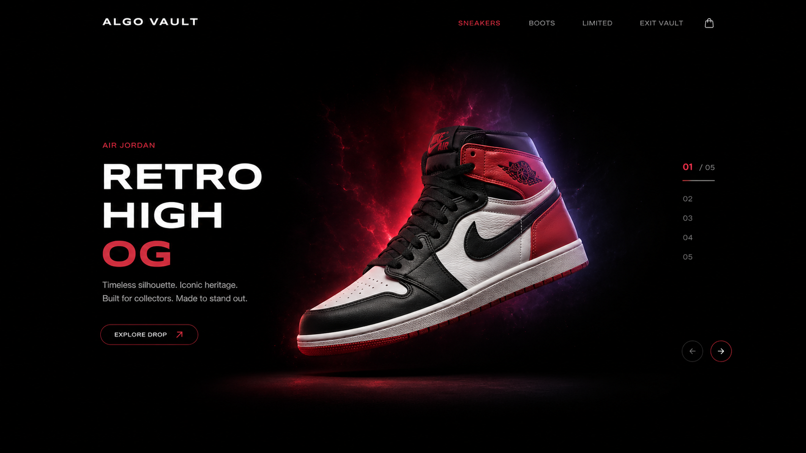

<div align="center">

# Algo Vault — Shoe Store

### *Built to flex. Made to browse.*

[](https://algo-vault-shoe-store.vercel.app)
[](https://github.com/TheAlgo7/algo-vault-shoe-store)
[](https://algo-vault-shoe-store.vercel.app)
[](https://thealgothrim.com)

</div>



Algo Vault is an interactive shoe store UI built as a frontend showcase. It presents a curated collection of 19 real sneakers, boots, and limited-edition grails — each with its own dynamic background, accent colour, and copy — all powered by a Swiper.js slider with creative 3D transitions. No backend, no cart, no checkout. Just a beautifully crafted UI that makes shoes feel like they belong in a gallery.

## Features

- **Dynamic theming** — Every slide switches the page background, gradient, and button colours to match the shoe's palette in real-time.
- **19 curated pairs** — Nike, Jordan, Dior, Timberland, Converse, and more — split across Sneakers, Boots, and Limited Edition.
- **Category browser** — Tap Sneakers, Boots, or Limited in the nav to open a modal listing all pairs. Click any to jump directly.
- **Image viewer** — Click "View Pair" to open a full modal with a clean image preview of the selected shoe.
- **Fully responsive** — Works cleanly from 320px to 4K.
- **Keyboard navigable** — Arrow keys cycle through slides; Escape closes modals.
- **Zero build step** — Pure static. Open `index.html` and go.

## Collection

| Category | Count | Brands |
| --- | --- | --- |
| **Limited Edition** | 5 | Nike x Travis, Dior, Jordan, Nike |
| **Sneakers** | 10 | Nike SB, Jordan, Converse, HRX, American Eagle, Lee Cooper, Aadi, Sparx |
| **Boots** | 4 | Timberland, Roadster, Freacksters, Afrojack |

## Stack

| Layer | Technology |
| --- | --- |
| Markup | Semantic HTML5 |
| Styling | Vanilla CSS with CSS custom properties |
| Slider | [Swiper.js](https://swiperjs.com/) — Creative Effect + dynamic pagination |
| Icons | [Remixicon 4.6](https://remixicon.com/) (CDN) |
| Hosting | [Vercel](https://vercel.com/) |

## Design Language

- **Dark-first.** The default experience is black — the shoes do the talking.
- **Shoe-driven theming.** Each pair sets its own background, gradient, and accent. The UI adapts to the product, not the other way around.
- **Minimal chrome.** One page, one section, no distractions.
- **Motion with purpose.** The 3D creative swipe effect makes browsing feel tactile without being gimmicky.

<details>
<summary>Quick Start</summary>

No build step. Just serve the files.

```bash
git clone https://github.com/TheAlgo7/algo-vault-shoe-store.git
cd algo-vault-shoe-store
```

Open directly:

```bash
start index.html   # Windows
open index.html    # macOS
```

Or serve locally:

```bash
npx serve .
# or
python -m http.server 8080
```

</details>

<div align="center">

Designed & developed by **[The Algothrim](https://thealgothrim.com)**

</div>
